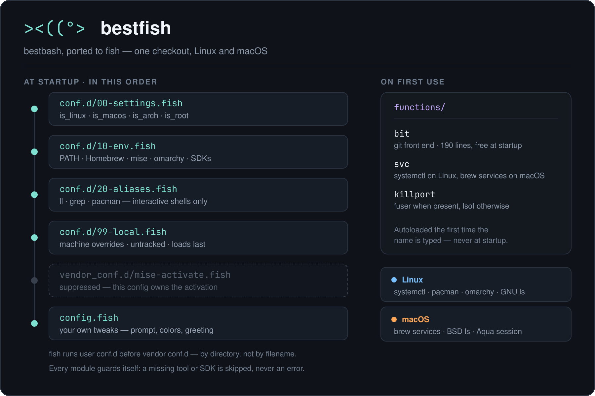

# bestfish

A small, modular fish configuration: aliases, functions and environment
variables split into single-purpose files. A port of
[bestbash](https://github.com/jadilson12/bestbash) to fish.

The goal is the same: a shell configuration you can read, diff and version,
where every module guards itself — a missing tool or SDK is skipped instead of
throwing errors at shell startup — so the same checkout works on a fresh
machine, a server or a full desktop.



## Install

```fish
git clone git@github.com:jadilson12/fish.git ~/.config/fish
exec fish
```

There is no `source` line to add. Unlike bash, fish loads `conf.d/*.fish`
automatically, so cloning into `~/.config/fish` is the whole installation.

If you already have a `~/.config/fish`, move it aside first — this repository
*is* the config directory, not a subdirectory of it.

## Layout

| File                          | Purpose                                                         |
| ----------------------------- | --------------------------------------------------------------- |
| `config.fish`                 | Interactive tweaks that are yours alone (prompt, colors).       |
| `conf.d/00-settings.fish`     | Platform detection predicates used by the other modules.        |
| `conf.d/10-env.fish`          | `PATH`, Homebrew, mise, omarchy, Chrome, Android SDK, Oracle.   |
| `conf.d/20-aliases.fish`      | Command aliases, including the pacman shortcuts.                |
| `conf.d/99-local.fish`        | Optional, untracked, machine specific overrides.                |
| `functions/`                  | `svc`, `killport`, `bit` — autoloaded on first use.             |
| `docs/`                       | The diagram above, and its SVG source.                          |

Load order is encoded in the numeric prefixes: fish sources `conf.d/` in
alphabetical order, before `config.fish`. `00-settings.fish` defines the
predicates everything else reads, and `99-local.fish` comes last so it can
override anything above it. Vendor snippets shipped by packages
(`vendor_conf.d/`) run after all of these — which is what lets this repository
suppress one, as it does for mise.

Functions are *not* in `conf.d/`. Files under `functions/` are autoloaded the
first time the name is typed, so `bit` and its 190 lines cost nothing at
startup — the one structural win fish gives you over the bash original.

## Features

### Platform detection — `conf.d/00-settings.fish`

Bash used string flags (`_isarch=true`) tested with `if $_isarch`. Fish has no
booleans, so the flags became predicate functions:

| Predicate       | True when                                          |
| --------------- | -------------------------------------------------- |
| `is_linux`      | running on Linux                                   |
| `is_macos`      | running on macOS                                   |
| `is_arch`       | running on Arch Linux or a derivative              |
| `is_x_running`  | a graphical session is attached (X11/Wayland/Aqua) |
| `is_root`       | the shell runs as root                             |

```fish
if is_arch
    # ...
end
```

The two values that cost a fork — `uname` and `id` — are resolved once at
startup and cached, the way the original evaluated them at source time.

`is_arch` gates the pacman aliases; `is_root` decides whether commands get
wrapped in `sudo`. `is_x_running` has no `DISPLAY` to read on macOS, so it asks
launchd instead: `launchctl managername` returns `Aqua` in a GUI session, which
is what separates a Terminal.app shell from an ssh one.

### Environment — `conf.d/10-env.fish`

- **Idempotent `PATH` handling.** `fish_add_path -gpP` replaces the hand written
  `_prepend_path`/`_append_path`: it refuses to add a duplicate, so re-sourcing
  never grows `PATH`. `-g` keeps it a global variable rather than a universal
  `fish_user_paths`, which would persist behind this repository's back. The
  `test -d` guard stays, because `fish_add_path` happily adds directories that
  do not exist.
- **mise instead of NVM.** `nvm` is a bash function — neither
  `/usr/share/nvm/init-nvm.sh` nor `~/.nvm/nvm.sh` can be sourced from fish —
  and [mise](https://mise.jdx.dev) already manages node, java and friends.
  Interactive shells get `mise activate`, which hooks the prompt so tool
  versions follow the directory; non-interactive shells get the shims on `PATH`,
  which is what mise recommends for scripts and editors.

  The mise package ships its own vendor snippet (`vendor_conf.d/mise-activate.fish`,
  under `/usr/share/fish` on Arch and `$HOMEBREW_PREFIX/share/fish` on macOS)
  that activates unconditionally, with no interactive/shims split. fish runs user
  `conf.d` *before* vendor `conf.d` — by directory, regardless of filename — so
  `MISE_FISH_AUTO_ACTIVATE=0` is set here in time to suppress it, keeping a
  single activation on our terms. It is set outside the `type -q mise` guard on
  purpose: if mise is uninstalled and the vendor snippet is left behind, every
  shell would otherwise start with `Unknown command: mise`.
- **Omarchy bootstrap.** `OMARCHY_PATH` is the variable that turns
  [omarchy](https://omarchy.org) on — `~/.config/hypr/hyprland.lua` and every
  `omarchy-*` command resolve their trees through it. Upstream exports it from
  `default/bash/env-bootstrap`, sourced by `/etc/profile.d/omarchy.sh`,
  `/etc/skel/.bashrc` and the uwsm session: all bash, none of which fish reads.
  A terminal opened inside the Hyprland session inherits it from uwsm and so
  looks fine, but `ssh host fish` does not get it. This is the fish half of that
  bootstrap, `omarchy dev link` (`/etc/omarchy.conf`) included.
- **SDKs, only when present.** `CHROME_BIN` for headless test runners, the
  Android SDK tool directories, and the Oracle Instant Client library path are
  each exported only if the corresponding directory or binary exists.
  `LD_LIBRARY_PATH` is now also duplicate-checked — sourcing the bash version
  twice in one shell used to stack the same directory up again.

**Shell history is not ported.** `HISTSIZE`, `HISTFILESIZE`, `HISTCONTROL` and
`HISTIGNORE` are bash variables; fish reads none of them and already does most
of what they bought — unbounded history, space-prefixed commands dropped,
deduplication on recall. There is no `HISTIGNORE` equivalent: fish stores
everything and leans on prefix search instead. For a shell that records nothing,
start it with `fish --private`.

### Aliases — `conf.d/20-aliases.fish`

In fish an alias *is* a function, and `alias ls 'ls -hF'` expands to
`command ls -hF` automatically, so the self-reference is not a recursion trap.
The whole module is wrapped in `status is-interactive` — aliases are only ever
typed.

- **Safer defaults:** human-readable `df`/`du`, `mkdir -p -v`, `nano -w`,
  `more` → `less`, `diff` → `colordiff` when it is installed.
- **Listing:** `ls`, `ll`, `la`, `lr` (recursive), `lm` (paged), with color.
- **Grep:** color on, `-d skip` so passing a directory is not an error, and
  `fgrep`/`egrep` mapped onto `grep -F`/`grep -E` to avoid the deprecation
  warning from GNU grep 3.8+.
- **Pacman** (Arch only): `pacin`, `pacre`, `pacse`, `pacupg`, `pacclean`,
  `pacmake` and friends, auto-prefixed with `sudo` when you are not root.
- **Privileged access:** `scat`, `svim`, `root`, `reboot`, `halt`.

**The omarchy pacman guard.** Omarchy installs an ALPM pre-transaction hook that
aborts a direct `pacman -Syu`, to push you towards `omarchy update` — which also
handles the update transcript, snapshot, keyrings, migrations, post-update hooks
and restart checks. `conf.d/10-env.fish` opts out of it with
`OMARCHY_ALLOW_DIRECT_PACMAN=1`; unset that variable to get the guard back.

Exporting it is not enough on its own: `sudo` runs with `env_reset`, so the
variable never reaches the hook running as root — which is why omarchy documents
the bypass as `sudo env OMARCHY_ALLOW_DIRECT_PACMAN=1 pacman -Syu`. The `pacman`
alias propagates it with `sudo env`, so the variable stays the single switch:
set, and `pacupg` runs straight through; unset, and the guard is back.

Two bash-isms did not survive the port:

- **`alias sudo='sudo '`** is gone. The trailing space was a bash-only trick to
  make the *next* word expand as an alias. Fish resolves `sudo pacupg` to a
  `pacupg` binary no matter what, so the alias would buy nothing and only hide
  sudo's own completions. It is not needed either: fish aliases are functions,
  so `pacupg` calls the `pacman` *function* and picks up the sudo on its own.
- **`${EDITOR:-vim}`** has no fish syntax. `fishrc` and `changemirror` go
  through the `_bestfish_editor` helper instead.

### Functions — `functions/`

**`svc <action> <unit>`** — a systemctl wrapper that adds `sudo` and appends the
`.service` suffix for you:

```fish
svc restart nginx      # sudo systemctl restart nginx.service
svc enable docker
start postgresql       # short forms: start, stop, restart
```

`status` is deliberately *not* defined as a short form, for the same reason bash
left out `enable`: it is a fish keyword, and fish refuses to let a function
shadow it (`cannot use reserved keyword as function name`). Use `svc status`.

**`killport <port>`** — kills whatever holds a TCP port, via `fuser` when
available and `lsof` otherwise:

```fish
killport 4000
```

### Git front end — `functions/bit.fish`

`bit` wraps a feature/hotfix/unstable branching workflow into short commands.
Run `bit` with no arguments for the full list. Note that fish's `switch` is
case sensitive, so the `C`/`c` and `P`/`p` pairs stay as distinct as they were
under bash's `case`.

```fish
bit --init               # interactive one-time git config (name, email, editor,
                         # color, mergetool, handy aliases)
bit a --all              # git add -A
bit c "message"          # commit -am
bit c --undo             # reset --soft HEAD^
bit b feature            # branch off unstable, creating it if needed
bit b hotfix             # branch off master
bit m feature "message"  # diff, merge --no-ff, delete the branch
bit m hotfix 1.2.0       # merge into unstable and master, tag, push tags
bit l                    # log --graph --oneline --decorate
bit P --force            # fetch --all + reset --hard origin/master
bit r 1.2.0              # release: merge unstable into master and tag it
```

### Local overrides — `conf.d/99-local.fish`

Copy `conf.d/99-local.fish.example` to `conf.d/99-local.fish` for anything that
belongs to one machine only. The `99` prefix makes fish load it after every
other module, so it can override any alias, function or variable set above it,
and it is listed in `.gitignore`.

This is also where API keys and tokens belong — never in a tracked module.

## Platform support

One checkout runs on both systems. What differs is handled by the platform
predicates, not by a separate branch or a second file:

| Area              | Linux                       | macOS                                        |
| ----------------- | --------------------------- | -------------------------------------------- |
| Package manager   | pacman aliases (Arch only)  | skipped — `is_arch` is false                 |
| Homebrew          | Linuxbrew, if installed     | `brew shellenv fish`, Intel or Apple Silicon |
| Services          | `svc` → `systemctl`         | `svc` → `brew services`                      |
| `ls` colors       | `--color=auto`              | `-G`, or `gls` when coreutils is installed   |
| `free`            | aliased to `free -m`        | skipped — procps does not exist there        |
| `dir` / `vdir`    | aliased with color          | skipped — GNU coreutils only                 |
| Android SDK       | `~/Android/Sdk`             | `~/Library/Android/sdk`                      |
| `CHROME_BIN`      | `google-chrome-stable`      | the binary inside `Google Chrome.app`        |
| Omarchy, Oracle   | set up when present         | skipped — Linux-only paths                   |

**Homebrew** is invoked through an absolute path, because on Apple Silicon
`/opt/homebrew/bin` is not on the default `PATH` and `brew` is unfindable until
`shellenv` has run. The shell is passed explicitly (`brew shellenv fish`) rather
than letting brew guess from `$SHELL`, which is wrong whenever fish is not the
login shell. It runs before the `PATH` block, so `~/.local/bin` and `~/bin` still
outrank it.

**`svc` on macOS** drives `brew services`, which shares the verbs and — unlike
raw `launchctl` — manages the plist for you. `status` maps to `info`; `enable`
and `disable` map to `start` and `stop`, because brew has no separate
enable/disable (its `start` both runs the service and registers it for login).
It deliberately runs **without** `sudo`: that would manage the service for root
instead of for you, and brew refuses outright.

**Oracle Instant Client stays Linux-only.** macOS would need
`DYLD_LIBRARY_PATH`, and System Integrity Protection strips `DYLD_*` from
protected binaries anyway, so an Instant Client on a Mac belongs in
`conf.d/99-local.fish` next to whatever tool actually needs it.

`killport` needs no branch: `fuser` does not exist on macOS, so it already falls
through to the `lsof` path.

The macOS paths were verified by simulation — stubbed `uname`, `launchctl` and
`brew` against a minimal `PATH` — not on Apple hardware.

## License

GPL-3.0 — see [LICENSE](LICENSE).
